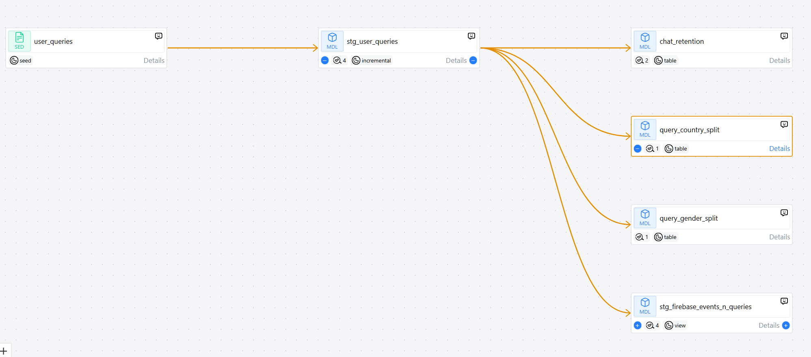
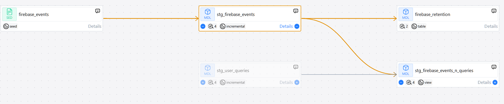
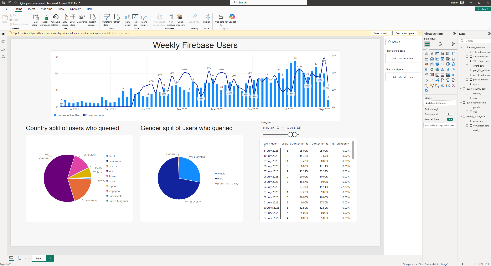


# Digital Green Assessment

#### Objective: 
The objective of the assessment is to clean and transform firebase_events and user_queries (two csv files provided as part of the assessment). Finally, to create an interactive dashboard clearly outlining metric definitions, etc

Listing down the objectives:
1. Data transformation
2. Data Validation
3. Analysis and Interactive Dashboard

## Data Transformation
I have used **dbt** as the framework of choice for the transformation layer. 

### Instructions to replicate the transformation layer

In essense, you need to clone this git repository and run the following commands:
```
dbt seed
dbt run
dbt test
dbt docs generate --target-path site
dbt docs serve
```

The last two commands `dbt docs generate --target-path site` generates the documentation using the yml files in the project while `dbt docs serve` hosts it on localhost for consumption

Detailed instructions are present [here](/Replicate_dbt_project.md)

### The transformation
#### raw
We use the 2 seed files to ingest them into `dbt_assessment.raw.<table_name>`, i.e., our files are ingested as `dbt_assessment.raw.firebase_events` and `dbt_assessment.raw.user_queries`

#### staging
These raw tables are then used to create a staging layer where we perform cleaning and data manupilation like standardizing timestamps, casting to date, etc. In the staging layer, we also summarize our data from the raw layer, into something more meaningful. Note that, in our case, we have summarized both raw data sources to `date x user_id` level. That means, our staging tables should be unique at `date x user_id` level. 

#### mart
Here we store business metrics and KPIs like weekly_active_users, conversion_rate, retention, etc.

Below is the lineage of our pipeline:
    
    


## Data Validation
I have used `dbt test` feature to perform data validation tests. I have also created custom tests like `unique_two_cols` and `variance`. You can find these at [/tests/generic/test_unique_two_cols.sql](../tests/generic/test_unique_two_cols.sql) and [/tests/generic/test_variance.sql](../tests/generic/test_variance.sql). 

DBT is running **22** data validation tests in the backend everytime you run `dbt test`. 

Here is a list of all the tests performed:
- `not_null`: tests to see if column has any nulls. If nulls are present, the test will fail
- `unique`: tests to see if column has unique records. If more than one record for column is found, the test will fail
- `unique_two_cols`: tests to see if the table is unique at two columns (composite key). E.g. in our project, we test to see if stg_user_queries model is unique at query_date and user_id level
- `variance`: tests to see if no. of records for latest date vs last 7 days from latest date is within absolute 1.96 z-score. If variation is >1.96 then the test will fail.

## Interactive dashboard
I have used powerbi to create an interactive dashboard showcasing the following metrics:
 - weekly firebase users
 - weekly conversion rate
 - country ratio of users who queried on FarmerChat
 - gender split of users who queried on FarmerChat
 - 3day, 7day and 14day retention


